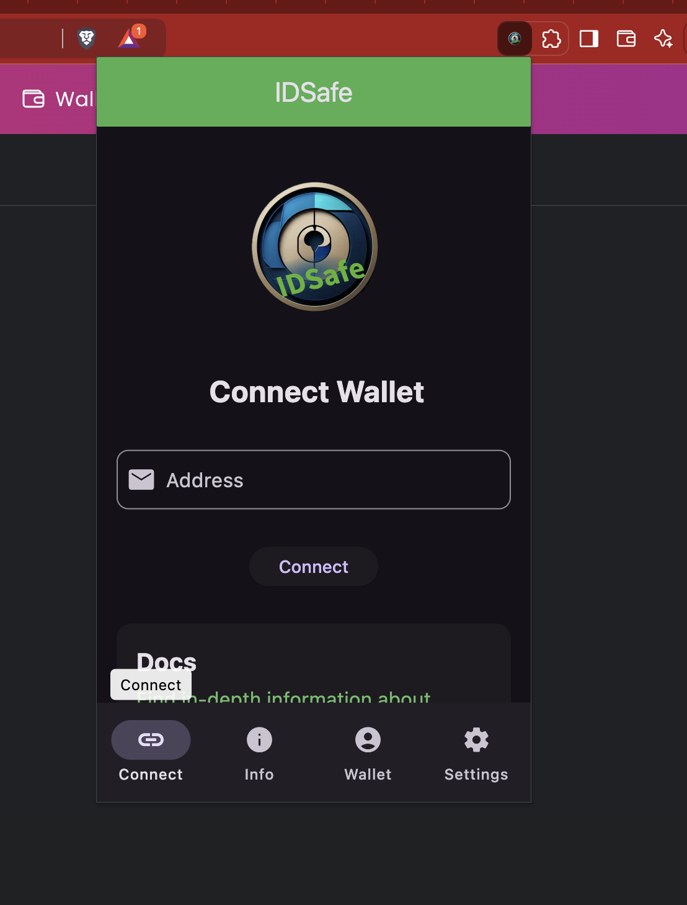
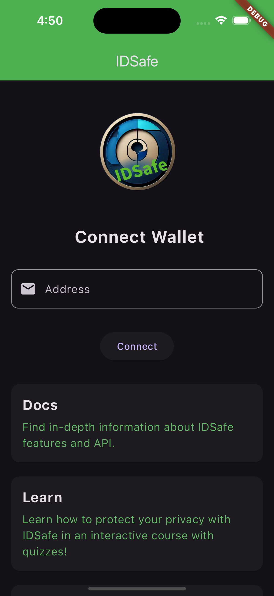
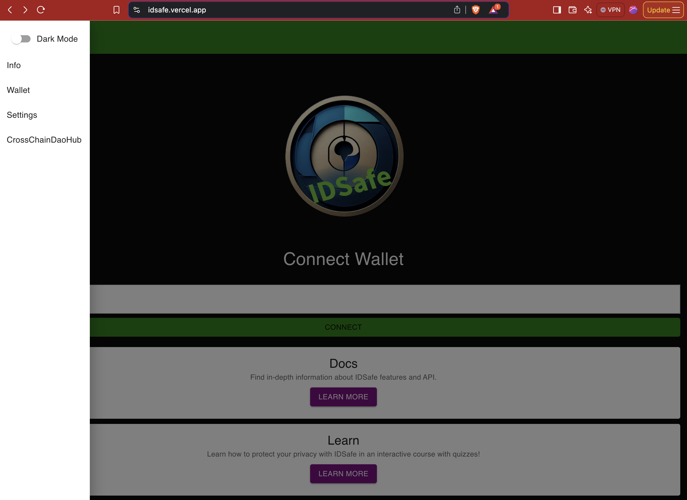

# IDSafe

A new solutions that enable users to interact with everyone onchain effortlessly (“interoperability”) while ensuring their safety (“security”). 

Use cross-chain tools from partners to help users navigate between subnet, the Avalanche mainnet, and other EVM chains.

IDSafe is designed to run on all devices and platforms, ensuring ubiquitous integration, accessibility, and security.

```IDSafe extension```


```IDSafe mobile```



```IDSafe web```


```IDSafe desktop```

## Getting Started

This project is a the codebase for IDSafe.

You will also find the SDK for utilizing this project at the repo https://github.com/Hackathonzx/IDSafe-sdk

A few resources to get you started if this is your first IDSafe integration:

- [Lab: Write your first Flutter app](https://docs.flutter.dev/get-started/codelab)
- [Cookbook: Useful Flutter samples](https://docs.flutter.dev/cookbook)

For help getting started with Flutter development, view the
[online documentation](https://docs.flutter.dev/), which offers tutorials,
samples, guidance on mobile development, and a full API reference.
